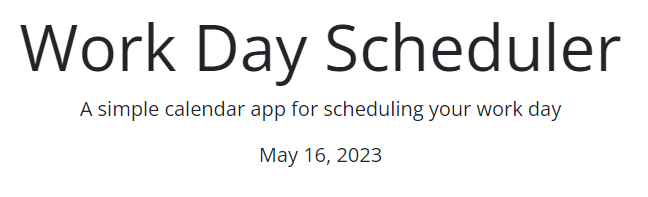

# Work Day Scheduler

## Description

In this project, I worked with existing code provided by The Coding Bootcamp on GitLab. I was motivated to add JavaScript to the existing code to give a user a color-coded work day scheduler.

This website was created for the purpose of giving the user a place to keep organized within a work day. It provides the opportunity to write in messages that can be saved to local storage. It has the added benefit of the time blocks changing color depending on the time of day.

Through the process of coding the password generator in JavaScript, I was able to learn more about local storage and also work with time with Day.js.

[Here is a link to the webpage](https://sarah-paterson.github.io/Work-Day-Scheduler/).

---
---

## Table of Contents

- [Starting Code](#starting-code)
- [Usage](#usage)
- [Credits](#credits)
- [License](#license)

---
---

## Starting Code

The key to this project was to add JavaScript functionality to the existing HTML and CSS. Below is the image of the file as just HTML and CSS. As you can see visually, there are interactive parts to the code that have no function without JavaScript. With the new JavaScript, a date will be at the top of the page, the **save** button will have an action once clicked, and the information in the box will be saved locally.

---

## Usage

The final website for the Work Day Scheduler shows the current date at the top, changes color in the hour blocks depending on the time of day, and offers a place to write text that will be saved to local storage.

### Current Date at the Top

### Block Text to Save and Color Changes

---

## Credits
Starter code from this gitLab repository: https://git.bootcampcontent.com/University-of-Denver/DU-VIRT-FSF-PT-04-2023-U-LOLC/-/tree/main/05-Third-Party-APIs/02-Challenge

The Coding Bootcamp repositories for Boot Camp Curriculum Lesson Plans: https://github.com/coding-boot-camp

Helpful Resources:
W3 School’s information about JavaScript: https://www.w3schools.com/js/default.asp
Stack Overflow’s answered questions about JavaScript: https://stackoverflow.com/
MDN’s information on JavaScript: https://developer.mozilla.org/en-US/
Google.com helping me find the above resources

The README template I used was provided by The Full-Stack Blog: https://coding-boot-camp.github.io/full-stack/github/professional-readme-guide

---

## License
MIT Licence

